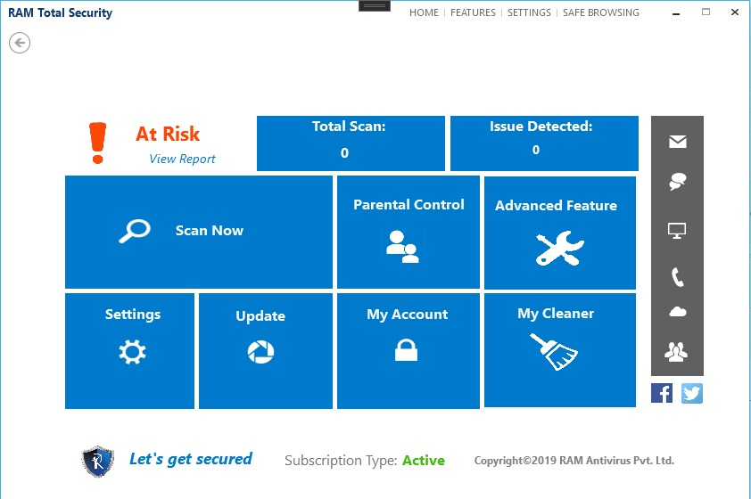
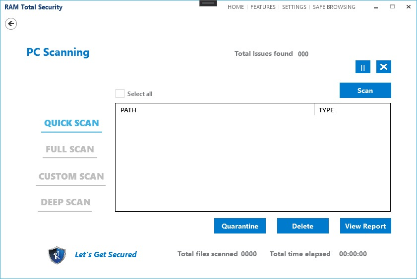
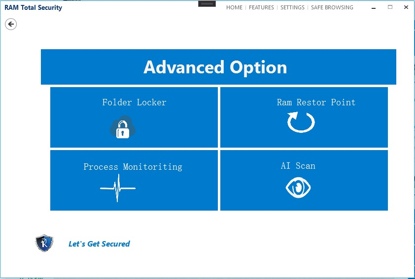
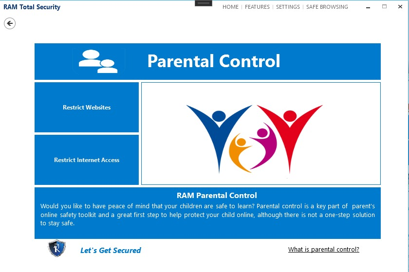
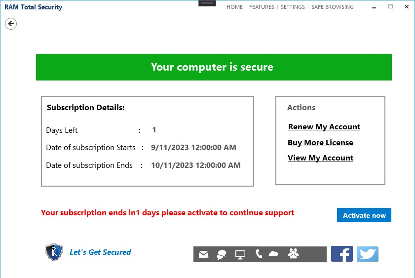
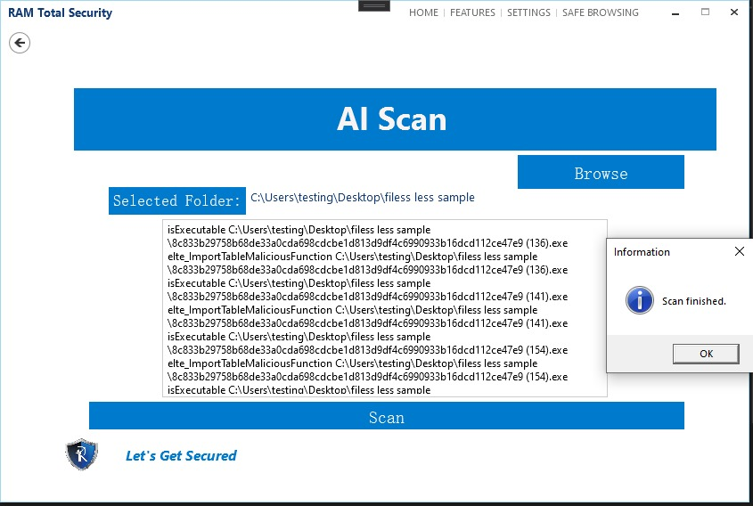

# RAM_AntiVirus
Work On Ram Antivirus.
Defend your PC against viruses and malware with the best antivirus software, offering real-time protection and frequent updates.

### What RAM Antivirus brings to you

RAM Antivirus is loaded with useful, functional options that allow users to quickly and easily Virus removal. But that’s not all, when you buy RAM Ultimate Antivirus you will also get the most amazing PRO Features!

1. Stop PC control takers: Protect your computer against threats: spyware, adware, Trojan horses, ransomware, PUP, hijackers, etc.

2. Robust and Real-time scanning: Get the most up-to-date protection with database updates 2 to 4 times a day, as well as in-depth System scan also analysis and removal tools.

3. Easy to use and affordable: Install our RAM Antivirus and get the Parental Controls lightweight program that will not slow down your PC and will not work with your antivirus.

[Dawanlode](https://ramantivirus.com/ram-ultimate-antivirus/)

# Real Time Protection
[Each and Every Day Protection Against NewBorn Viruses. Real-Time Protection- While you are busy Surfing!](https://ramantivirus.com)

# Powerful Firewall 
[Strong web network security system control that examines incoming and outgoing web interface traffic.](https://ramantivirus.com)

# Personal Security
[Helps you to protect your personal and financial data from the expert level hackers when you surf the internet.](https://ramantivirus.com)

# Web Protection

[Protects you from Spam emails and Phishing tactics that are striking through the internet. ](https://ramantivirus.com)

# Prevention is better than Cure, Be Secured from Ransomware

[Ransomware](https://ramantivirus.com/ransomware) restricts access to your computer system and demands that a ransom be paid for the restriction to be removed. Cybercriminals are simply looking for the easiest way to infect a computer system or network and use this backdoor to spread malicious content. [Ransomware](https://ramantivirus.com/ransomware) is developed by crooks who are experts in computer programming. It can get into your computer through an email attachment or through your browser if you visit a website infected with this type of malware. It can also access your computer through your network.

[ Linkdin ]([https://in.linkedin.com/company/ram-ultimate-antivirus](https://www.linkedin.com/in/rajendra-ghongade-07b337259?utm_source=share&utm_campaign=share_via&utm_content=profile&utm_medium=android_app))

# Ram Social Media

[ Linkdin ](https://in.linkedin.com/company/ram-ultimate-antivirus)

[ Twitter ](https://twitter.com/ramantivirus)

[ YouTube ](https://www.youtube.com/@ramantivirus1598)

[ Instagram ](https://www.instagram.com/ramantivirus/?hl=en)

[ FeceBook ](https://www.facebook.com/ramantivirus)

[# Dawanlode The RAM Antivirus And Let's Secure To Your Pc.](https://ramantivirus.com/1year/Total_Security_64bit.exe)

